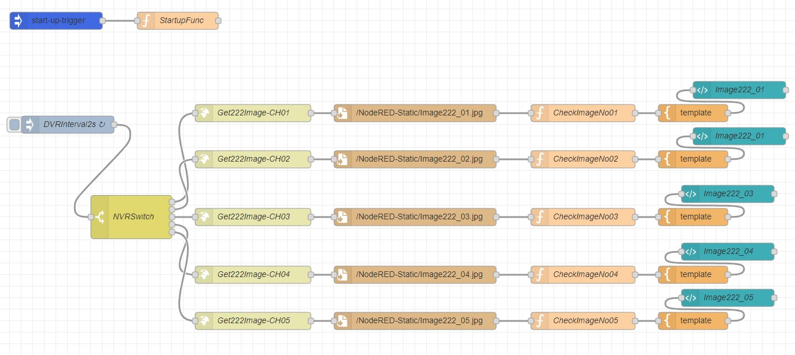
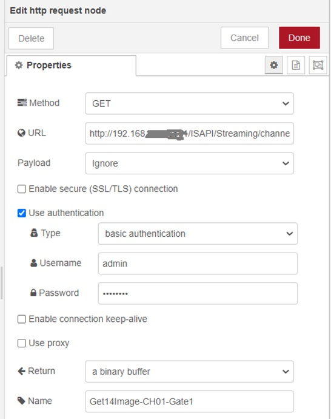
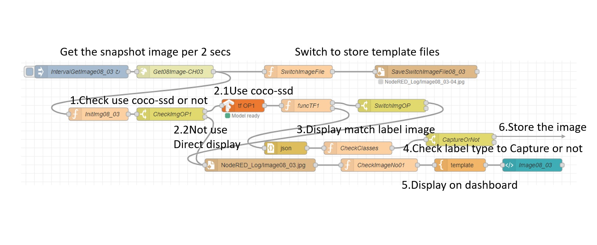

# Get the snapshot from DVR or IP CAM

#### Requirements

* DVR or IP CAM supported snapshot API.
* Recommended using NAS with Node-RED to get the pictures.

#### The example flow(we can integrate DVRs and IP CAMs, redesign their layout by production lines ex.&#x20;






How to connect to DVRs and IP CAM?

Use \[http request] node, and input the API URL. See the documents from the supplier.

The authentication must be correct. Check the documents and the DVR server setting is basic authentication or digest authentication or another way.

HIKVISION DVR: ChannelNo: Camera 1:101, Camera 2:102, ...,Camera13:113

&#x20;   `http://IP:port/ISAPI/Streaming/channels/[ChannelNo]/picture`&#x20;

Dahua DVR, DJS DVR: ChannelNo: Camera1:1...

&#x20;        `http://IP:port/cgi-bin/snapshot.cgi?channel=[ChannelNo]`

EDIMAX IP CAM:

&#x20;         `http://IP/snapshot.jpg`


Save the image in \[httpStatic] directory in this example is `/NodeRED-Static/`.


```
// Sample code
// code in CheckImageNo01----------------------------

//new Date().getTime() to ensure the browser will refresh the picture
msg.payload="/Image222_01.jpg?" + new Date().getTime();  
msg.pwidth="350";             //set the picture width, match the [template] node
global.set("fnNVRSel","2");   //change the switch to 2nd camera
return msg;
// end of CheckImageNo01-----------------------------


<!-- code in template node -->
<br/>
<a href="{{payload}}" target="_blank"><font color="yellow">Full Image</font></a>
<!-- end of template node -->


<!-- code in image222_01 node(ui-template) -->
<div ng-bind-html="msg.payload" align="center"></div>
<!-- end of image222_01 node -->
```

The output image examples are not truly factory images.



1. You can design to receive the signal of DI(Infrared sensor ex. ) or read the file from the temperature sensor K3Pro ex. to get the snapshot.
2. And also design to save the image file of the events by setting different filenames.
3. Use the Node-RED node node-red-contrib-tfjs-coco-ssd which are pre-trained  tensorflow.js model for object detection and get the snapshot(event) images for the objects.


### Example of running the pre-trained tensorflow.js model coco-ssd for object detection

<figure><figcaption></figcaption></figure>

This example running well in Windows. After get the snapshot image from DVR or IPCam(you can test to set the inject node by 1-3secs), store the image to template file, in this example, loop recording 6 file names, for you to adjust to store the timings of the images.

1. Check use coco-ssd or not.&#x20;
2. Use coco-ssd:confirm the status of coco-ssd node  is Model ready in green color. and store the image detected by coco-ssd. if there are objects detected, coco-ssd will add bbox on the objects.&#x20;
3. Display match label image:If you only want  to detect specific classes, add label names you want to detect in the function node of \[CheckClasses]. The labels of coco-ssd module,&#x20;
4. Check to capture or not.&#x20;
5. Display the image on dashboard.
6. If the objects are your main object, then store the image. you can set the image filename by YYYYMMDDhhmmssCAMxxx.jpg and store the time serial data in the MongoDB.

```
// Code in CheckClasses function node
// Labels in coco-ssd
//    person, bicycle, car, motorcycle, airplane, bus, train, 
//    truck, traffic light, fire hydrant, stop sign, parking meter, 
//    bird, cat, dog, horse, sheep, cow, elephant, bear, zebra, giraffe, 
//    backpack, umbrella, handbag, tie, suitcase, frisbee, skis, snowboard, 
//    sports ball, kite, baseball glove, skateboard, surfboard, tennis racket, 
//    bottle, wine glass, cup, fork, knife, spoon, bowl, banana, apple, sandwhich, 
//    orange, broccoli, carrot, pizza, donut, cake, chair, couch, potted plant, 
//    bed, dining table, toilet, tv, laptop, mouse, remote,, keyboard, cell phone,
//    microwave, oven, toaster, sink, refrigerator, book, clock, vase, scissor, 
//    teddy bear, hair drier, toothbrush
var tfClasses=msg.payload;
try {
  msg.payload="N";
  if (tfClasses.indexOf("car")>=0 || tfClasses.indexOf("truck")>=0 || tfClasses.indexOf("person")>=0 ) {
     msg.payload="Y";        //output
  }
} catch (err) {
    msg.payload="N";
}
return msg;
```

If you want to using custom TensorFlow.js model more informations on "[https://developer.ibm.com/tutorials/building-a-machine-learning-node-for-node-red-using-tensorflowjs/](https://developer.ibm.com/tutorials/building-a-machine-learning-node-for-node-red-using-tensorflowjs/)"
