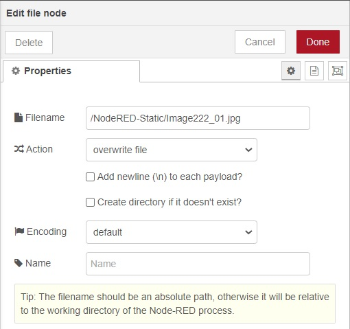

# Get the snapshot from DVR or IP CAM

#### Requirements

* DVR or IP CAM supported snapshot API.
* Recommended using NAS with Node-RED to get the pictures.

#### The example flow(we can integrate DVRs and IP CAMs, redesign their layout by production lines ex.&#x20;



How to connect to DVRs and IP CAM?

Use \[http request] node, and input the API URL. See the documents from the supplier.

The authentication must be correct. Check the documents and the DVR server setting is basic authentication or digest authentication or another way.

HIKVISION DVR: ChannelNo: Camera 1:101, Camera 2:102, ...,Camera13:113

&#x20;   `http://IP:port/ISAPI/Streaming/channels/[ChannelNo]/picture`&#x20;

Dahua DVR, DJS DVR: ChannelNo: Camera1:1...

&#x20;        `http://IP:port/cgi-bin/snapshot.cgi?channel=[ChannelNo]`

EDIMAX IP CAM:

&#x20;         `http://IP/snapshot.jpg`


Save the image in \[httpStatic] directory in this example is `/NodeRED-Static/`.



```
// Sample code
// code in CheckImageNo01----------------------------

//new Date().getTime() to ensure the browser will refresh the picture
msg.payload="/Image222_01.jpg?" + new Date().getTime();  
msg.pwidth="350";             //set the picture width, match the [template] node
global.set("fnNVRSel","2");   //change the switch to 2nd camera
return msg;
// end of CheckImageNo01-----------------------------


<!-- code in template node -->
<br/>
<a href="{{payload}}" target="_blank"><font color="yellow">Full Image</font></a>
<!-- end of template node -->


<!-- code in image222_01 node(ui-template) -->
<div ng-bind-html="msg.payload" align="center"></div>
<!-- end of image222_01 node -->
```

The output image examples are not truly factory images.



1. You can design to receive the signal of DI(Infrared sensor ex. ) or read the file from the temperature sensor K3Pro ex. to get the snapshot.
2. And also design to save the image file of the events by setting different filenames.
3. Use the Node-RED node node-red-contrib-tfjs-coco-ssd that uses tensorflowjs for object detection and get the snapshot images for the objects.

