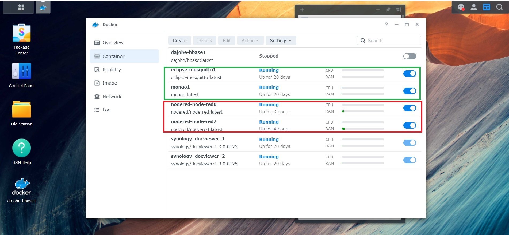
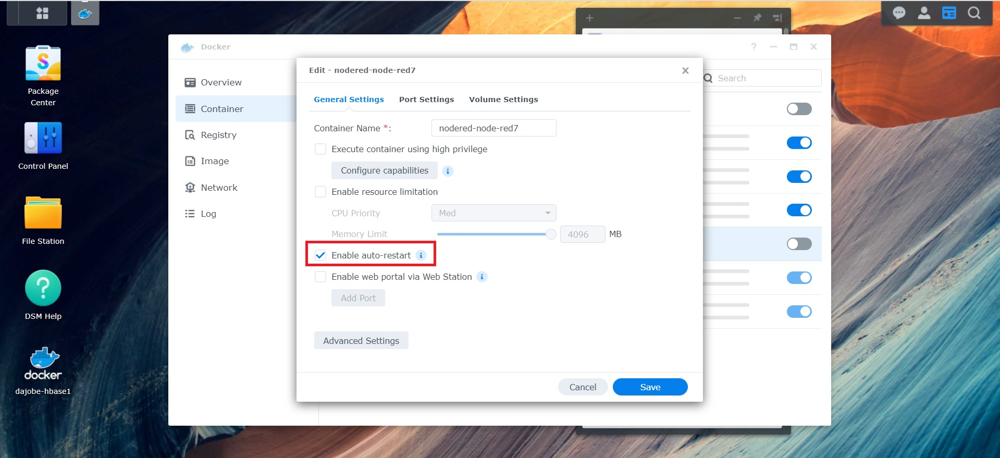

# The I-IoT platform for SME


After our surveys and study for the company.  There are limited resources for SMEs(Small and medium-sized enterprises). Need some economic programs to create a private cloud of I-IoT.  In this chapter, we will cover the following topics:

* NAS(Network Attached Storage)  as the Node-RED server,  Mosquitto MQTT server(Message Queuing Telemetry Transport), and DB server(we install MongoDB).
* Raspberry pi installs Node-RED as the gateway and for edge computing.
* The functions of NAS and Raspberry pi


The following diagram depicts the proposed framework of the I-IoT platform for SMEs.&#x20;

There is much wireless technology developed.  In our case, we used WIFI Wireless IoT sensing devices to connect to sensors and actuators in the factory. The examples In the diagram depicts above are the Advantech WISE-4000 series.&#x20;

The MQTT and RESTful API are our IT communication protocols.  The Modbus, OPC, and RS-232 are the main OT communication protocols.

NAS(Network Attached Storage)  as the Node-RED server,  MQTT server, and Mongo DB server. Raspberry pi is the gateway and for edge computing.

And used NAS to communicate with ERP and MES(maybe there no MES in the company, but I suggested there is ERP at least).


### The benefits of using NAS

We can find the NASs used in many companies. And the functions progress over time. We can very easy to use Docker to install The Node-RED server, MQTT server, and MongoDB. The benefits of using NAS are:

* More storage spaces
* Private cloud storage
* The simple server setup procedure
* Automated backup
* Data protection

### The Roles of NASs and  Raspberry Pi

The following diagram depicts the relationship between NASs and Raspberry Pi


The detail of the functions outlined in the following diagram:



* For the ethernet configuration, we suggest 3  network segments at least, and they are separated by the firewall. Please see the following table.
* Each NAS in addition to designing many tabs for the dashboard page. It can install 2 instants of Node-RED, like 1880 port or 1887 port. You can use these features
* Raspberry Pi can add the extension box UNO-220 of Advantech. There are more benefits from the box. You can get more information from Advantech.


### The ethernet configuration for ERP/MES Server, NASs, and Raspberry Pi

Subnets 1, 2, and 3 in the following table, mean 192.168.1.x, 192.168.2.x, 192.168.3.x for example. You can configure them to 192.168.11.x, 192.168.21.x, 192.168.31.x also. Some DSCs, PLCs have different subnets.

|                            |       1st Lan Port      |       2nd Lan Port      |
| -------------------------- | :---------------------: | :---------------------: |
| ERP/MES                    |         Subnet 1        |            NA           |
| NAS-1                      |         Subnet 1        |         Subnet 2        |
| NAS-2                      |         Subnet 1        |         Subnet 2        |
| Raspberry Pi for Dashboard |         Subnet 2        |            NA           |
| IoT Sensing devices        |         Subnet 2        |            NA           |
| Raspberry Pi for Edge      | <p>Subnet 2<br>Wifi</p> |  <p>Subnet 3<br>Lan</p> |
| DSC, PLC  or controller    |         Subnet 3        |            NA           |
| Your Computer              |  <p>Subnet 1<br>Lan</p> | <p>Subnet 2<br>Wifi</p> |

### The Service installed by Docker for NAS

The following diagram depicts the installation of the proposed services by Docker for NAS. We will install Eclipse Mosquitto MQTT data broker("eclipse-mosquitto1"), Node-RED platform(2 instances "nodered-node-red0" use 1880 port and "nodered-node-red7" use 1887 port), and MongoDB("mongoIoT1" in this example) in the Synology NAS.&#x20;

<figure><figcaption><p>Download the Node-RED image from Docker </p></figcaption></figure>

<figure><figcaption><p>Example of install MQTT, MongoDB, Node-RED Server in Snology NAS</p></figcaption></figure>

When installing the packages, please checked the auto restart option.

<figure><figcaption></figcaption></figure>

After installing MQTT, MongoDB and Node-RED server, you must find the setting.js file to  implement the security of the Node-RED platform, and the public directory for Node-RED to access, which named "httpStatic".&#x20;

Create a simple flow for the instance of Node-RED. The system will create a flow file(flow.json). You must use SSH service to connect the NAS, and find this file, and the settings.js will in the same directory. Please use one of the command show below. After you finishing the edit of the settings.js, for the security reason, please unchecked the SSH function of the NAS.

<pre><code><strong>sudo su                          //use superuser account
</strong><strong>find /volume1/@docker/volumes -name flows.json    //or
</strong><strong>find /volume1/@docker/volumes -name settings.js </strong></code></pre>

you will find the directory of these files look like

```
/volume1/@docker/volumes/6359804d2163e45448a618515b9fa10084a2bff7b7bf91aff410a468730f38ee/_data

```

<figure><figcaption><p>Find the directory of the settings.js</p></figcaption></figure>

After finding the settings.js file, you must edit the settings.js for the security of Node-RED

Include the parameters of adminAuth, httpNodeAuth and httpStaticAuth. The passwords are encoded by the Linux Node-RED command.

```
sudo npm install -g node-red-admin      //Install Node-RED package
sudo node-red-admin hash-pw             //Call the hash-pw function 

```

Use node-red-admin to get the hash encode of your password. And then put the hash encode password in the settings.js. If the NAS not support the npm command, you can try to install in the Raspberry pi or Windows to get the hash code.

<figure><figcaption><p>Example of edit the security parameters of settings.js</p></figcaption></figure>

After Finishing the procedures above, please restart the Node-RED service.

### The services install to Raspberry Pi

* mosquitto MQTT
* Node-RED

The install procedure and settings you can find more information on the internet.

### The nodes install for Node-RED of NAS and Raspberry Pi

After you finished installing the NAS and Raspberry Pi, and their services. In this book, we install the nodes for Node-RED of NAS and Raspberry Pi as follows, please use the \[Manage palette] of the menu in Node-RED.

<figure><figcaption></figcaption></figure>
