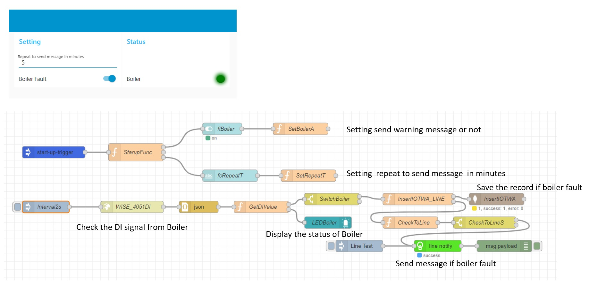

# Alarm Record and Publish

The following is a list of several I-IoT use cases in the alarm system

* The damage, breakdowns, or over the limits of the asset. For example, boiler, water supply, environment monitor system, fire alarm system, and so on.
* &#x20;Security system.
* Manufacturing operations shutdown, in this case, we had been discussed in the previous chapter.

#### &#x20; Requirements

* A signal from the alarm source or extend from the physical alarm device. Or tracing the value of the alarm source which is over or below the limit.
* If the signal is from the source open/close dry contact or wet contact, you can use the digital Input device to convert the signal, please reference the chapter "[Reading data from Digital Input(DI) signal](../getting-started/reading-data-from-analog-input-ai-and-digital-input-di-signals.md)".

An example of the alarm application



* You can set the control point On/Off by the switch.
* Setting the interval of the repeat to send the warning message and store the record to MongoDB. But the LED will display the status of the sensor.

```
//Sample of the records of alarm IOTWA(MongoDB)
[
  {
    "_id": "601574441f8d6a0010854ca8",
    "DocID": "WARNING",
    "tcPoint": "Boiler A",
    "tcCate": "Energy_Oil",
    "tcDate": "2021/01/30",
    "tdBegin": "2021-01-30T22:59:16.025Z",
    "tcMessage": "Boiler A Fault",
    "tcToERP": "N"
  }
]
```
